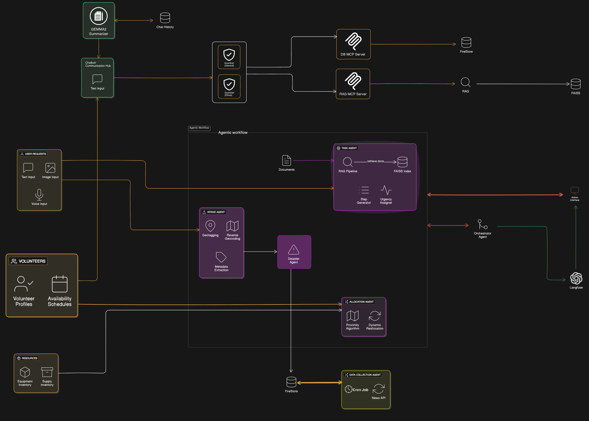

# Backend Setup Guide

## Prerequisites

- Python 3.7 or above installed
- A virtual environment configured in the `backend` directory

## Setup Steps

1.  **Open Terminal and Navigate to the Backend Directory**
    -   If you're not already in the `backend` directory, run the following command:
        ```bash
        cd backend
        ```
2.  **Add Environment Variables**

    Create a `.env` file in the `backend` directory and define the following environment variables:

    ```env
    GOOGLE_APPLICATION_CREDENTIALS=app/secrets/firebase_cred.json
    GOOGLE_APPLICATION_CREDENTIALS_MCP=secrets/firebase_cred.json
    GROQ_API_KEY=your_api_key
    LANGFUSE_SECRET_KEY=""
    LANGFUSE_PUBLIC_KEY=""
    LANGFUSE_HOST=""
    ```
3.  **Create Virtual Environment**
    -   Create a virtual environment if you don't have one installed:
        ```bash
        python -m venv env
        ```

4.  **Activate the Virtual Environment**
    -   Activate the virtual environment using the following command (Windows):
        ```bash
        .\env\Scripts\activate
        ```
    -   For macOS/Linux, use:
        ```bash
        source env/bin/activate
        ```
5.  **OPTIONAL Script to start all the services at once**
    -   You can start all the services required for the backend (celerty worker, MCP servers and FAST API) try running the following script if it fails follow the given steps :
        ```bash
         .\setup_backend.ps1
        ```

6.  **Install Dependencies**
    -   Install the required Python packages by running:
        ```bash
        pip install -r requirements.txt
        ```
7.  **Create a folder named `secrets` inside the `app` folder and place the `firebase_cred.json` file inside it.**
    -   This is required to access Firestore from the backend.

8.  **Run the Application**
    -   Start the backend server with hot-reloading enabled:
        ```bash
        python -m uvicorn app.main:app --reload
        ```

---

## Setting up Celery with Redis

This project uses [Celery](https://docs.celeryq.dev/en/stable/) for asynchronous task processing and [Redis](https://redis.io/) as the message broker.

### Environment Variables

Before running the worker, set the following environment variables in your **terminal session**.

```powershell
$env:GROQ_API_KEY         = "your-groq-api-key-here"
$env:LANGFUSE_SECRET_KEY  = "your-langfuse-secret-key-here"
$env:LANGFUSE_PUBLIC_KEY  = "your-langfuse-public-key-here"
$env:LANGFUSE_HOST        = "https://your-langfuse-host-url"
```

**Note that you need to be inside the backend directory and your virtual environment should be activated.**
Then start the Celery worker:

```powershell
celery -A app.celery_config.celery_app worker --loglevel=info --pool=solo
```

---

## Setting up MCP Servers

### 1. DB Server

To set up and run the DB server:

-   If not already in the `backend` directory, navigate there:
    ```bash
    cd backend
    ```
-   Activate your virtual environment:
    ```bash
    .\env\Scripts\activate
    ```
-   Then navigate to the DB server directory:
    ```bash
    cd app/chatbot/mcp_servers/db
    ```
-   Before running the server, add the same `secrets` folder containing `firebase_creds.json` file that we used above, inside the `db` folder. path should be `app/chatbot/mcp_servers/db/secrets`
-   Finally, run the server:
    ```bash
    python server.py
    ```

### 2. RAG Server

To set up and run the RAG server:

-   If not already in the `backend` directory, navigate there:
    ```bash
    cd backend
    ```
-   Activate your virtual environment:
    ```bash
    .\env\Scripts\activate
    ```
-   Then navigate to the RAG server directory:
    ```bash
    cd app/chatbot/mcp_servers/rag
    ```
-   Finally, run the server:
    ```bash
    python server.py
    ```

---

# Frontend Setup Guide

1.  **Open Terminal and Navigate to the Frontend Directory**
    -   If you're not already in the `frontend` directory, run the following command:
        ```bash
        cd frontend
        ```
2.  **Install Dependencies**
    -   Install the required npm packages by running:
        ```bash
        npm install react@18.2.0 react-dom@18.2.0
        ```
    -   If you come across any error, try:
        ```bash
        npm install --force
        ```
3.  **Run the Application**
    -   Start the frontend development server:
        ```bash
        npm run dev
        ```
4.  **Add Environment Variables**

    Create a `.env.local` file in the `frontend` directory and define the following environment variables:

    ```env
    NEXT_PUBLIC_FIREBASE_API_KEY=your_api_key_here
    NEXT_PUBLIC_FIREBASE_AUTH_DOMAIN=your_auth_domain_here
    NEXT_PUBLIC_FIREBASE_PROJECT_ID=your_project_id_here
    NEXT_PUBLIC_FIREBASE_STORAGE_BUCKET=your_storage_bucket_here
    NEXT_PUBLIC_FIREBASE_MESSAGING_SENDER_ID=your_messaging_sender_id_here
    NEXT_PUBLIC_FIREBASE_APP_ID=your_app_id_here
    NEXT_PUBLIC_API=http://localhost:8000
    ```

---

# AI Workflow Explanation

ResQConnect’s AI workflow is organized into a multi‐agent pipeline, where each agent focuses on a specific responsibility. Below is a step‐by‐step summary of how user input becomes a prioritized, actionable task:



1. **Intake Agent**  
   - **Input Sources:** Receives help requests via text, image, or voice.  
   - **Processing Steps:**  
     1. Auto‐geotags incoming requests using latitude/longitude and reverse geocoding.  
     2. Extracts metadata (type of need, urgency indicators, affected individual count) via lightweight NLP and computer vision.  
   - **Output:** Publishes a “new request” event (containing enriched metadata and media URLs) into Redis for downstream consumption.

2. **Disaster Agent**  
   - **Input:** Listens for “new request” events.  
   - **Processing Steps:**  
     1. Compares request location against existing disaster records (using simple geographic clustering).  
     2. If the location matches an active disaster, tags the request with that Disaster ID; otherwise, suggests a “new disaster” creation for admin approval.  
   - **Output:** Emits either a “matched request” event (for existing disasters) or a “disaster suggestion” event to the Admin Interface.

3. **Task Agent (RAG Pipeline)**  
   - **Input:** Receives “matched request” events (including user metadata and Disaster ID).  
   - **Processing Steps:**  
     1. Queries the FAISS index for disaster‐specific documents (situation reports, SOPs, volunteer observation embeddings).  
     2. Generates step‐by‐step instructions and assigns an “intelligent urgency” score.  
     3. Summarizes any lengthy context (e.g., volunteer observations or past chat history) to reduce token usage while retaining critical details.  
   - **Output:** Persists a recommended Task object in Firestore (with urgency and resource requirements) and emits a “new task” event.

4. **Chatbot & Communication Hub**  
   - **Input:** Subscribes to “chat‐message” events from users (Affected Individuals, Volunteers, First Responders).  
   - **Processing Steps:**  
     1. Maintains full conversation history in memory; when message length approaches token limits, uses Gemma2 to summarize older messages.  
     2. Has read‐only access to Firestore to fetch relevant disaster context and SOPs for more accurate responses.  
     3. Validates each message for guardrail compliance (no hate speech, no disallowed content).  
   - **Output:** Responds with context‐aware, RAG‐augmented replies and logs all interactions (including user feedback) to Langfuse for observability and continuous improvement.

5. **Allocation Agent**  
   - **Input:** Triggered by “task approved” events after an admin reviews and confirms the Task Agent’s recommendation.  
   - **Processing Steps:**  
     1. Queries Firestore for available volunteers (filtered by skill, schedule, and Disaster ID) and resource inventory.  
     2. Runs a proximity‐aware, token‐efficient optimization algorithm to assign volunteers and resources to the approved task.  
     3. If any volunteer or resource availability changes (tracked via Firestore triggers), re‐enqueues unfulfilled tasks for reallocation.  
   - **Output:** Writes final allocation records to Firestore and emits an “allocation completed” event.

6. **Orchestrator Agent**  
   - **Input:** Subscribes to all lifecycle events (new request, matched request, new task, allocation completed).  
   - **Processing Steps:**  
     1. Routes callbacks and status updates back to the API Gateway so that clients (web/mobile) receive real‐time WebSocket notifications or FCM push messages.  
     2. Aggregates metrics (queue length, task processing time, LLM token usage) and streams them to Prometheus/Loki and Langfuse.  
     3. Monitors overall health of Celery workers and triggers AgentOps to restart any failed or stalled processes automatically.  
   - **Output:** Ensures end-to-end coordination, client notifications, and continuous observability.
   - 
7. **Data Collection Agent (External Updates)**  
   - **Input:** Scheduled cron job pulls external news briefs, situation reports, or SOP documents via a configured News API.  
   - **Processing Steps:**  
     1. This mainly acts as a third party service 
     2. Deployed as a serveless cloud function and will trigger on a predefined schedule.

All AI suggestions whether a “new disaster” recommendation, task creation, or resource allocation, enter a human-in-the-loop approval step via the Admin Interface before being finalized in Firestore. Guardrail filters run across every agent to check for disallowed content (ethics, domain relevance), ensuring safe, reliable operations.


## Assumptions Made

1. **Reliable Internet Connectivity:** Affected individuals and volunteers have intermittent Internet access, but the PWA is designed to cache critical data for offline use.  
2. **Admin Availability for Approvals:** It is assumed that a government coordinator or platform admin is available to review and approve AI-driven suggestions in a timely manner.   
3. **Geolocation Accuracy:** Device‐provided latitude/longitude is sufficiently accurate (±50 meters) for matching requests to existing disasters.  
4. **Single Active Disaster per Geographic Cluster:** Geographic clustering logic assumes that requests within a small radius (e.g., 5 km) belong to the same disaster event.    
5. **Disaster Document Availability:** Up-to-date situation reports, SOPs, and volunteer observations are regularly ingested via the Data Collection Agent to keep the FAISS index accurate.
6. **Guardrail Coverage:** Ethics and domain-relevance checks are enforced via a predefined list of prohibited content patterns and disaster‐specific keywords.  
